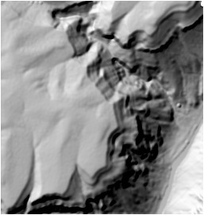
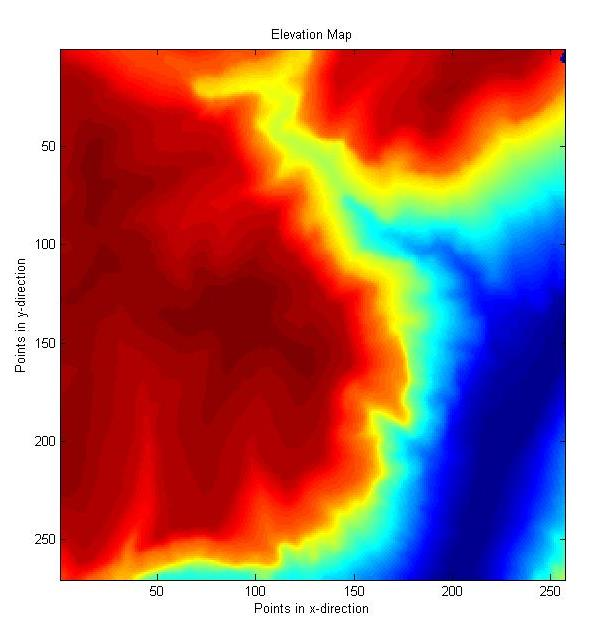
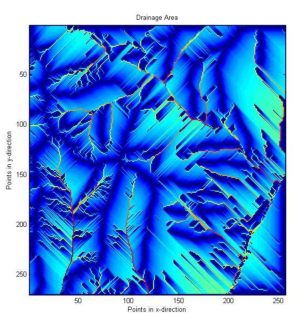

# Geomorphic Processes of a Mesa in New Mexico

In this study, an arbitrary mesa bordering the Rio Grande River is interpreted based on its hydraulic gradient and drainage. On the plateau of this mesa, water is expected to run off down the steepest gradient, and off the steep sides or into bordering channels, and into the river. No landslide features are associated with this mesa, instead, most of the processes are indicative of physical weathering, and the mesa was shaped by the downcutting of the Rio Grande. The resulting maps are useful for obtaining a general sense of the landscape’s geomorphology, though there may be some overlapping in the regime map.    

Lidar map:

      

Elevation and drainage maps:

           

Slop and drainage area:

