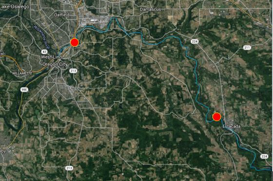
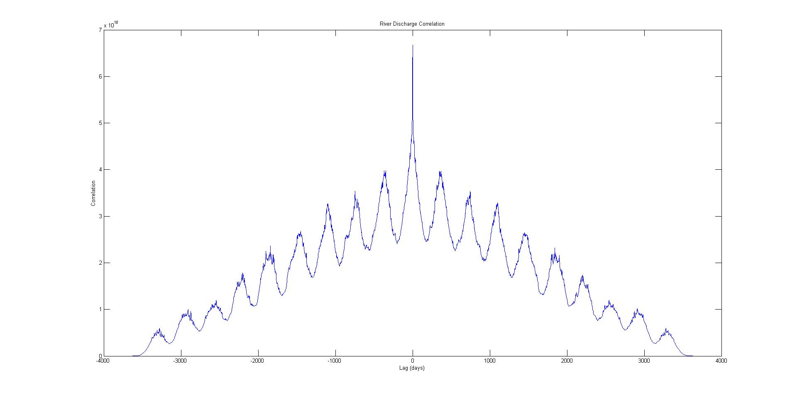

# TimeSeriesAnalysis
Time series analysis of the Clackamas river

The Clackamas River flows approximately 20 miles from Estacada to Oregon City in a winding path before it merges with the Willamette. Within the time that the river flows there are cyclical patterns that can be observed, such as seasonal, annual, or diurnal patterns, and others that are so discreet that a time series analysis is needed to extract them. With data collected over a long enough period of time, these components can be extracted and interpreted independently. For the section of the Clackamas River highlighted in the figure below, the primary focus is on how much the collected data correlates from one location to the other, and how much it “lags” or is offset at both stations. This is only one way of modeling this river for events that happen over time. 

   

Detrended power spectra for discharge and temperature:

     

The power spectra indicate how much signal is at what frequency. The frequency domain in this case is in units of the Nyquist frequencies. The spectrum for discharge is more noisy and complex because the original data is also the same way. There is one steep spike in each of the plots because there is a dominant signal in each of the data sets, and the most of the other spikes are a result of short-term noise.

  

Nothing out the ordinary is displayed in the correlation plots because there is no lag or inconsistencies in long or even short-term trends in discharge or temperature. Perhaps if the downstream location was to be much farther down the Willamette than in Oregon City, then there would be some lag or differences in correlation.
